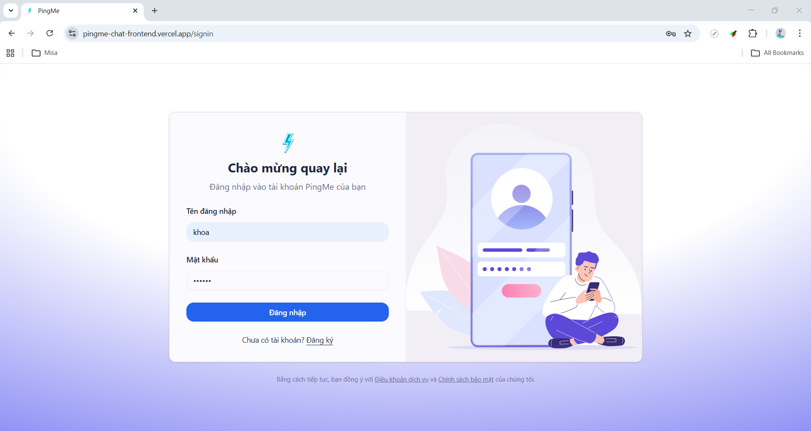
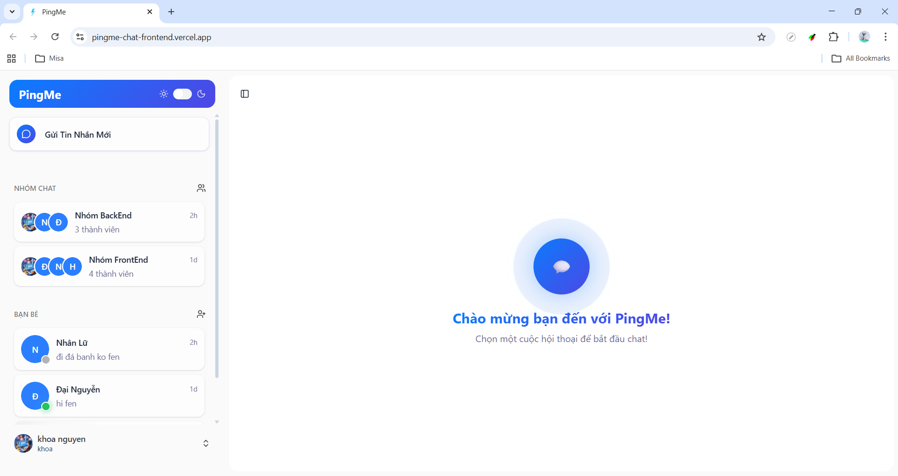

# 💬 PingMe Chat

> A real-time fullstack chat application built with React, Node.js, MongoDB, and Socket.IO.

---

## 🚀 Features

### 🌟 Core Functionalities

- Real-time direct and group chat
- Send text, images, and file attachments
- Theming: Toggle between Dark and Light mode
- Infinite scroll message history
- Seen status and unread message count
- Online / offline user status

### 🔐 User Authentication

- JWT authentication (access + refresh token)
- Secure session with HTTP-only cookies

### 👥 Social Features

- Send / accept / decline friend requests
- Cancel friend requests
- Manage friend list

### 📎 Media & Files

- Upload avatar
- Multi-image messages
- File attachments (preview & download)
- Drag & drop upload

---

## 🛠️ Tech Stack

- **Frontend:** React + TypeScript + Tailwind CSS + Zustand
- **Backend:** Node.js + Express.js + MongoDB + Socket.IO
- **Authentication:** JWT
- **Media Storage:** Cloudinary
- **Others:** Axios, multer, Swagger

---

## 🌐 Getting Started

### Prerequisites

- Node.js
- MongoDB

---

### Installation

#### 1. Clone the repository

```bash
git clone https://github.com/ThanhDai2005/pingme-chat.git
cd pingme-chat
```

#### 2. Configure Environment Variables

Create `.env` in backend:

```env
PORT=3000
MONGO_URL=your_mongodb_connection
ACCESS_TOKEN_SECRET=your_secret_key

CLOUD_NAME=your_cloudinary_name
CLOUD_KEY=your_cloudinary_key
CLOUD_SECRET=your_cloudinary_secret

CLIENT_URL=http://localhost:5173
```

Create `.env` in frontend:

```env
VITE_API_URL=http://localhost:3000/api/v1
VITE_SOCKET_URL=http://localhost:3000
```

#### 3. Setup Backend

```bash
cd backend
npm install
npm run dev
```

#### 4. Setup Frontend

```bash
cd frontend
npm install
npm run dev
```

---

## 📸 Screenshots

### 1.Sign In



### 2. Chat UI



---

## 🤝 Contributing

Contributions are welcome! Feel free to fork and submit a pull request.

---

## 💌 Contact

- **Developer:** [ThanhDai2005](mailto:Dai2272005nv@gmail.com)
- **GitHub:** [GitHub Profile](https://github.com/ThanhDai2005)
